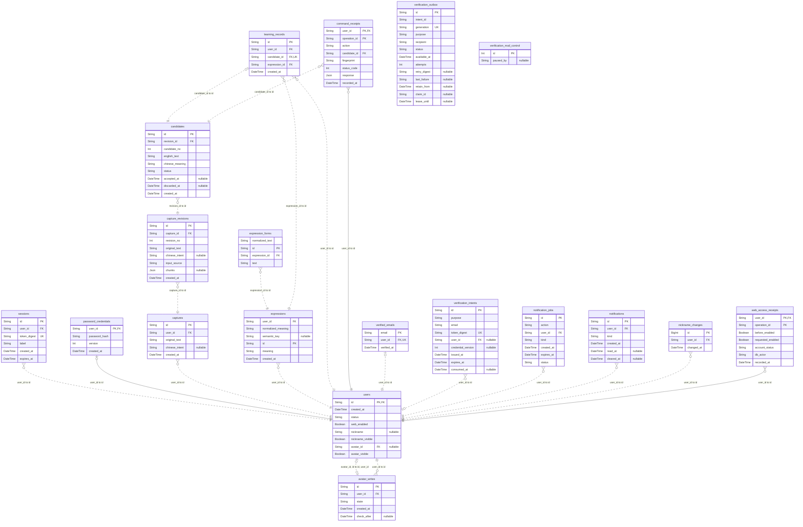

# EPP 数据模型

```mermaid
erDiagram
  users {
    String id PK,FK
    DateTime created_at
    String status
    Boolean web_enabled
    String nickname "nullable"
    Boolean nickname_visible
    String avatar_id FK "nullable"
    Boolean avatar_visible
  }
  sessions {
    String id PK
    String user_id FK
    String token_digest UK
    String label
    DateTime created_at
    DateTime expires_at
  }
  password_credentials {
    String user_id PK,FK
    String password_hash
    Int version
    DateTime created_at
  }
  captures {
    String id PK
    String user_id FK
    String original_text
    String chinese_intent "nullable"
    DateTime created_at
  }
  capture_revisions {
    String id PK
    String capture_id FK
    Int revision_no
    String original_text
    String chinese_intent "nullable"
    String input_source
    Json chunks "nullable"
    DateTime created_at
  }
  candidates {
    String id PK
    String revision_id FK
    Int candidate_no
    String english_text
    String chinese_meaning
    String status
    DateTime accepted_at "nullable"
    DateTime discarded_at "nullable"
    DateTime created_at
  }
  expressions {
    String user_id FK
    String normalized_meaning
    String semantic_key "nullable"
    String id PK
    String meaning
    DateTime created_at
  }
  expression_forms {
    String normalized_text
    String id PK
    String expression_id FK
    String text
  }
  learning_records {
    String id PK
    String user_id FK
    String candidate_id FK,UK
    String expression_id FK
    DateTime created_at
  }
  command_receipts {
    String user_id PK,FK
    String operation_id PK
    String action
    String candidate_id FK
    String fingerprint
    Int status_code
    Json response
    DateTime recorded_at
  }
  verified_emails {
    String email PK
    String user_id FK,UK
    DateTime verified_at
  }
  verification_intents {
    String id PK
    String purpose
    String email
    String token_digest UK
    String user_id FK "nullable"
    Int credential_version "nullable"
    DateTime issued_at
    DateTime expires_at
    DateTime consumed_at "nullable"
  }
  verification_outbox {
    String id PK
    String intent_id
    String generation UK
    String purpose
    String recipient
    String status
    DateTime available_at
    Int attempts
    String retry_digest "nullable"
    String last_failure "nullable"
    DateTime retain_from "nullable"
    String claim_id "nullable"
    DateTime lease_until "nullable"
  }
  verification_mail_control {
    Int id PK
    String paused_by "nullable"
  }
  notification_jobs {
    String id PK
    String action
    String user_id FK
    String kind
    DateTime created_at
    DateTime expires_at
    String status
  }
  notifications {
    String id PK
    String user_id FK
    String kind
    DateTime created_at
    DateTime read_at "nullable"
    DateTime cleared_at "nullable"
  }
  nickname_changes {
    BigInt id PK
    String user_id FK
    DateTime changed_at
  }
  avatar_writes {
    String id PK
    String user_id FK
    String state
    DateTime created_at
    DateTime check_after "nullable"
  }
  web_access_receipts {
    String user_id PK,FK
    String operation_id PK
    Boolean before_enabled
    Boolean requested_enabled
    String account_status
    String db_actor
    DateTime recorded_at
  }
  users |o..o| avatar_writes : "avatar_id, id to id, user_id"
  sessions }o..|| users : "user_id to id"
  password_credentials |o--|| users : "user_id to id"
  captures }o..|| users : "user_id to id"
  capture_revisions }o..|| captures : "capture_id to id"
  candidates }o..|| capture_revisions : "revision_id to id"
  expressions }o..|| users : "user_id to id"
  expression_forms }o..|| expressions : "expression_id to id"
  learning_records }o..|| users : "user_id to id"
  learning_records |o..|| candidates : "candidate_id to id"
  learning_records }o..|| expressions : "expression_id to id"
  command_receipts }o--|| users : "user_id to id"
  command_receipts }o..|| candidates : "candidate_id to id"
  verified_emails |o..|| users : "user_id to id"
  verification_intents }o..o| users : "user_id to id"
  notification_jobs }o..|| users : "user_id to id"
  notifications }o..|| users : "user_id to id"
  nickname_changes }o..|| users : "user_id to id"
  avatar_writes }o..|| users : "user_id to id"
  web_access_receipts }o--|| users : "user_id to id"
```
